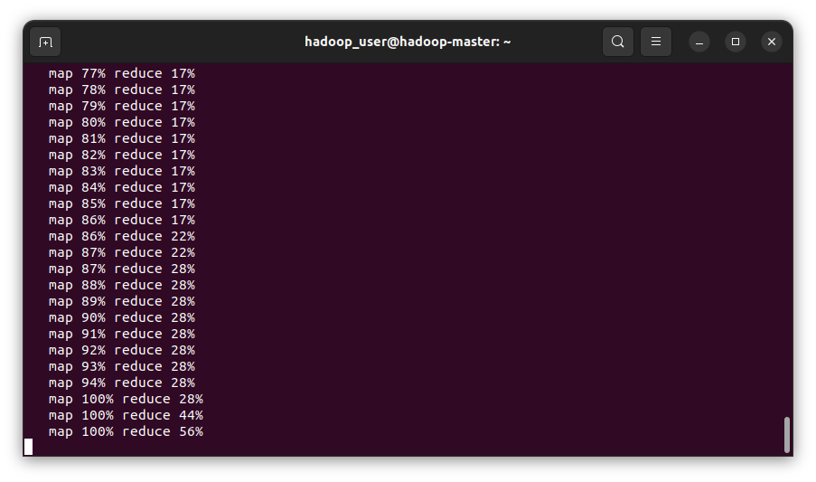

# Проект по информатике

Цель проекта - развертывание кластера из виртуальных машин с установленной на них распределенной файловой системой, чтобы созданный кластер мог служить средством обработки больших данных в соответствии с парадигмой распределенных вычислений MapReduce. 

Здесь будут пошагово описаны все этапы выполнения работы с приведением необходимых команд, скринов и комментариев.

### Этап 0. Предварительная подготовка виртуальных машин

#### 0.1 Создание ВМ

В VirtualBox Manager создайте три ВМ: Master, Slave 1 и Slave 2. Первая машина будет основной и будет выполнять роль планировщика задачи и координатора, а остальные будут производить вычисления.


В настройках ВМ подключите их все в одну NAT Network. Так они получат разные ip и смогут общаться между собой.


#### 0.2 Установление соединения между ВМ

Далее необходимо установить связь между машинами. Все действия надо проделать на каждой ВМ. 
Установите SSH:
```bash
sudo apt install ssh
```

Создайте SSH-ключ с типом rsa
```bash
ssh-keygen -t rsa -P ""
```

Сохраните ключ в авторизованные, чтобы при подключении к ВМ не нужно было вводить пароль
```bash
cat ~/.ssh/id_rsa.pub >> ~/.ssh/authorized_keys
```


Получите ip-адрес каждой машины с помощью команды
```bash
ip addr
```
Эти адреса нужно занести в файл `/etc/hosts` с hostname'ми машин, чтобы можно было обращаться к ним по имени, а не по ip. Удалите из того же файла строки localhost, иначе это вызовет ошибки при выполнении MapReduce-задач


Теперь при вызове команды `ssh <hostname>` можно подключиться к машине с именем hostname

#### 0.3 Установка Java

Java - основная вещь, на которой работает HDFS. Мы воспольуемся Openjdk версией.
```bash
sudo apt install openjdk-8-jdk
```

С помощью команды `update-alternatives --list java` можно узнать, в какую директорию произошла установка

Скопируйте путь до `jre` в файл `/etc/environment` в переменную `JAVA_HOME`


### 1. Установка и настройка HDFS

#### 1.1 Установка

Скачайте архив с hadoop:
```bash
sudo wget -P ~ https://dlcdn.apache.org/hadoop/common/hadoop-3.3.6/hadoop-3.3.6.tar.gz
```
Разархивируйте его:
```bash
tar xzf hadoop-3.3.6.tar.gz
```
Для удобства дальнейшего использования переименуйте папку в просто `hadoop` и перенесите в `/usr/local`, потому что для работы с HDFS будет создаваться отдельный пользователь
```bash
mv hadoop-3.3.6 /usr/local/hadoop
``` 

Эти действия надо сделать для каждой машины


#### 1.1 Создание отдельного пользователя

Для работы с HDFS желательно (но не обязательно) создать отдельного пользователя. Пусть он будет именоваться `hadoop_user`
Создате пользователя:
```bash
sudo adduser hadoop_user
```
Затем с помощью следующих команд происходит создание группы для пользователя, передача пользователю папки `/usr/local/hadop`, изменение прав доступа к ней и добавление пользователя в группу `sudo`
```bash
sudo usermod -aG hadoop_user hadoop_user
sudo chown hadoop_user:root -R /usr/local/hadoop/
sudo chmod g=rwx -R /usr/local/hadoop/
sudo adduser hadoop_user sudo
```

Это необходимо провести для всех ВМ. Затем с помощью команды `su hadoop_user` войдите в систему от имени созданного пользователя

#### 1.2 Настройка конфигурационных файлов

На этом этапе надо сделать множество конфигурационных файлов для HDFS. Все их можно сделать на Master, а потом перенести на остальные узлы кластера.

В файл `.bashrc` необходимо внести следующие переменные (заметьте, что они зависят от имени пользователя, пути до Java и пути до папки с hadoop). Эти же переменные надо внести еще и в файл `/usr/local/hadoop/etc/hadoop/hadoop-env.sh`
```bash
export JAVA_HOME="/usr/lib/jvm/java-8-openjdk-amd64/"
export HADOOP_HOME="/usr/local/hadoop"
export HADOOP_INSTALL=$HADOOP_HOME
export HADOOP_MAPRED_HOME=$HADOOP_HOME
export HADOOP_COMMON_HOME=$HADOOP_HOME
export HADOOP_HDFS_HOME=$HADOOP_HOME
export YARN_HOME=$HADOOP_HOME
export HADOOP_COMMON_LIB_NATIVE_DIR=$HADOOP_HOME/lib/native
export PATH=$PATH:$HADOOP_HOME/sbin:$HADOOP_HOME/bin
export HADOOP_OPTS="-Djava.library.path=$HADOOP_HOME/lib/native"
export HDFS_NAMENODE_USER="hadoop_user"
export HDFS_DATANODE_USER="hadoop_user"
export HDFS_SECONDARYNAMENODE_USER="hadoop_user"
export YARN_RESOURCEMANAGER_USER="hadoop_user"
export YARN_NODEMANAGER_USER="hadoop_user"
export AIRFLOW_HOME="/home/hadoop_user/airflow"
```

Чтобы переменные стали используемыми, напишите `source ~/.bashrc`

Создайте новый SSH-ключ (`ssh-keygen -t rsa`) и установите его на все ВМ:
```bash
ssh-copy-id -i ~/.ssh/id_rsa.pub hadoop_user@hadoop-master
ssh-copy-id -i ~/.ssh/id_rsa.pub hadoop_user@hadoop-slave1
ssh-copy-id -i ~/.ssh/id_rsa.pub hadoop_user@hadoop-slave2
```

Теперь можно подключаться к другим ВМ к новому пользователю ез пароля

В файл `/usr/local/hadoop/etc/hadoop/core-site.xml` внесите следующую конфигурацию:
```xml
<configuration>
<property>
<name>fs.default.name</name>
<value>hdfs://hadoop-master:9000</value>
</property>
</configuration>
```

В файл `/usr/local/hadoop/etc/hadoop/hdfs-site.xml` внесите следующую конфигурацию:
```xml
<configuration>
<property>
<name>dfs.name.dir</name>
<value>/usr/local/hadoop/data/nameNode</value>
</property>
<property>
<name>dfs.data.dir</name>
<value>/usr/local/hadoop/data/dataNode</value>
</property>
<property>
<name>dfs.replication</name>
<value>1</value>
</property>
</configuration>
```

Параметры с `dir` указывают на путь к папке с данными о Namenode - узлом, который хранит маппинг между файлами и блоками - и Datanodes - узлов, которые непосредственно хранят данные. Параметр `replication` говорит о количестве копий одного и того же блока, которы могут находиться в DFS

В файл `/usr/local/hadoop/etc/hadoop/mapred-site.xml` внесите следующую конфигурацию:
```xml
<configuration>
<property>
<name>mapreduce.framework.name</name>
<value>yarn</value>
</property>
<property>
<name>mapred.job.tracker</name>
<value>hadoop-master:9001</value>
</property>
<property>
   <name>yarn.app.mapreduce.am.env</name>
   <value>HADOOP_MAPRED_HOME=/usr/local/hadoop</value>
</property>
<property>
   <name>mapreduce.map.env</name>
   <value>HADOOP_MAPRED_HOME=/usr/local/hadoop</value>
</property>
<property>
   <name>mapreduce.map.env</name>
   <value>HADOOP_MAPRED_HOME=/usr/local/hadoop</value>
</property>
<property>
   <name>mapreduce.reduce.env</name>
   <value>HADOOP_MAPRED_HOME=/usr/local/hadoop</value>
</property>
<property>
    <name>mapreduce.application.classpath</name>
    <value>(ВСТАВЬТЕ CLASSPATH)</value>>
</property>
</configuration>
```

Значение для classpath можно узнать с помощью команды `hadoop classpath` (оно слишком длинное, чтобы здесь его приводить)

В файл `/usr/local/hadoop/etc/hadoop/yarn-site.xml` внесите следующую конфигурацию:
```xml
<configuration>
    <property>
        <name>yarn.nodemanager.aux-services</name>
        <value>mapreduce_shuffle</value>
    </property>
    <property>
        <name>yarn.nodemanager.auxservices.mapreduce.shuffle.class</name>
        <value>org.apache.hadoop.mapred.ShuffleHandler</value>
    </property>
    <property>
        <name>yarn.resourcemanager.hostname</name>
        <value>hadoop-master</value>
    </property>
</configuration>
```

Здесь главный параметр - `yarn.resourcemanager.hostname`, который должен указывать на главную ноду в кластере, которая будет планировщиком. Если этого не сделать, рспределение задач не будет работать

В файл `/usr/local/hadoop/etc/hadoop/workers` перечислите hostname'ы тех ВМ, которые будут вычислительными узлами. Если оставить в файле `localhost`, то главная нода тоже будет производить вычисления (мы убрали)


Теперь конфиги можно скопировать в Slave'ов (это замймет долгое время)
```bash
scp -r /usr/local/hadoop/* hadoop-slave1:/usr/local/hadoop
scp -r /usr/local/hadoop/* hadoop-slave2:/usr/local/hadoop
```

#### 1.3 Форматирование HDFS

Для развертывания HDFS осталось написать всего несколько команд:
Форматирование Namenode'ы делается м помощью команды
```bash
hdfs namenode -format
```
Обратите внимание, что при форматировании меняется параметр `cluster-id`, записанный в файле `/usr/local/hadoop/data/nameNode/current/VERSION`. Так что при повторном запуске этой команды (при отлове ошибок, например), далее нужно будет либо выполнить форматирование Datanode'ов (`hdfs datanode -format`), либо поменять вручуню `cluster-id` в файлах параметров нод, которые указывались в конфиге `hdfs-site.xml`, так, чтобы он был одинаковым для Namenode и Datanode


HDFS-сеть запускается командой
```bash
start-dfs.sh
```
Если по какой-то причине alias для команды не создася, путь до этого скрипта такой: `/usr/local/hadoop/sbin/start-dfs.sh`

YARN запускается командой 
```bash
start-yarn.sh
```

Если по какой-то причине alias для команды не создася, путь до этого скрипта такой: `/usr/local/hadoop/sbin/start-yarn.sh`

Проверить запущенные процессы можно с помощью команды `jps`


Информацию о кластере можно смотреть с помощью веб-интерфейса

По адресу `hadoop-master:9870` доступна информация по используемым ресурсам, datanode'ам, занятой памяти и прочему. Нас интересует больше всего вкладка с Datanode'ами


По адресу `hadoop-master:8088` доступна информация о запущенных MapReduce-задачах, контролируемых YARN


### 2. Решение поставленной задачи

Пусть имеется датасет, содержащих данные о покупках - timestamp совершения, регион, категорию товара, валюту, в которой совершена покупка и стоимость в этой валюте. Необходимо построить график, отражающий почасовую выручку регионов для одной категории товаров с наибольшей суммарной выручкой в пересчете на рубли.

Датасет устроен следующим образом:


#### 2.0 Помещение файла в РФС

Поместим файл со входными данными в распределенную файловую систему.
```bash
hdfs dfs -mkdir /user
hdfs dfs -mkdir /user/student
hdfs dfs -mkdir /user/student/input
```
Здесь создаетя папка пользователей, папка для пользователя `student` и внутри нее папка для выходнух данных.

Поместим файл в HDFS с помощью команды `-put`
```bash
hdfs dfs -put /ict_project/data.tsv /user/student/input/data.tsv
```


В веб-интерфейсе также можно увидеть, что файл создался. Здесь же видно, что он помещен блоками на оба рабочих узла, то есть распределенность работает


#### 2.1 Получение данных о валютах

Для получения данных воспользуйтесь бесплатным API https://open.er-api.com 
Для получения данных был написан скрипт на Bash, который посылает GET-запрос на API, берет из полученного json-файла только нужные даннные (rates) и сохраняет в файл в папке `lab`

```bash
curl https://open.er-api.com/v6/latest/RUB | jq -r ".rates" > /home/hadoop_user/lab/currencies.json
```

#### 2.2 Создание MapReduce-задачи

На этом этапе можно написать два скрипта - mapper и reducer - и потом средствами hdfs их запускать, а можно написать MapReduce-задачу с поомщью бибиотеки `mrjob` для python, которая поддерживает запуск кк на локальной машине, так и на кластере

```python
#!/usr/bin/env python3
# -*-coding:utf-8 -*
from mrjob.job import MRJob
from mrjob.job import MRStep
from datetime import datetime
import json


class Make(MRJob):
    def configure_args(self):
        super().configure_args()
        self.add_file_arg('--currencies')

    def mapper_init(self):
        if not getattr(self, "currencies", False):
            self.currencies=json.load(open(self.options.currencies))

    def mapper_hour(self, key, value):
        timestamp, region, currency, category, profit = value.split("\t")
        date = datetime.fromtimestamp(int(timestamp)).isoformat()[:13]
        yield (date, region, category), float(profit) * (1 / self.currencies[currency])

    def reducer_sum(self, key, values):
        yield key, sum(values)

    def steps(self):
        return [
            MRStep(
                mapper_init=self.mapper_init,
                mapper=self.mapper_hour,
                reducer=self.reducer_sum,
            )
        ]


if __name__ == '__main__':
    Make.run()
```

При запуске это задачи нужно передавать параметр `--currencies` - путь к файлу с данными о валютах. В `mapper_init` данные из файла сохраняются в атрибуты объекта класса MRJob

В маппере `mapper_hour` данные преобразуются так, что час совершения покупки, регион и категория товара - это ключ, а стоимость в рублях - значение

В функции-свертке `reducer_sum` стоимости для записей с одним групповым ключом суммируются

Запустим скрипт локально:
```bash
python3 lab/mapred_script.py --currencies lab/currencies.json /ict_project/data.tsv
```


Все выполнилось успешно, поэтому можно запускать MapReduce-задачу на кластере. MRJob по умолчани выводит все в stdout, поэтому сохраним данные в файл `lab/output.tsv`

```bash
python3 lab/mapred_script.py --currencies lab/currencies.json -r hadoop hdfs:///user/student/input/data.tsv
```





Как можно увидеть, задача выполнилась успешно и данные в `output` сохранены.

#### 2.3 Визуализация

Скрипт для анализа данных и их визаулизации написан с помощью библиотек `pandas` и `matplotlib`

```python
import pandas as pd
from matplotlib import pyplot as plt

df = pd.read_csv("/home/hadoop_user/lab/output.tsv", delimiter="\t", header=None, names=["key", "profit"])

df[["date", "country", "category"]] = df["key"].str.split('", "', expand=True)
df = df.drop(columns=["key"])
df["date"] = pd.to_datetime(df["date"].str.lstrip('["'), format="%Y-%m-%dT%H")
df["category"] = df["category"].str.rstrip('"]')
df["max_category_profit"] = df.groupby("category")["profit"].transform("sum") 

vs = df[df["max_category_profit"] == df["max_category_profit"].max()]

fig, ax = plt.subplots(figsize=(8,6))
for country, values in vs.groupby('country'):
    ax.plot(values["date"], values["profit"], label=country)


plt.title(f'Profit of {vs.iloc[0]["category"]}')
plt.xlabel("Day, hour")
plt.ylabel("Profit, rub.")

box = ax.get_position()
ax.set_position([box.x0, box.y0 + box.height * 0.1,
                 box.width, box.height * 0.9])

ax.legend(loc='upper center', bbox_to_anchor=(0.5, -0.05),
          fancybox=True, shadow=True, ncol=5)

plt.savefig("/home/hadoop_user/lab/graph_profit.png")
```

В нем происходит группировка данных по категории, сохранение суммы стоимостей покупок для категории, затем оставляются только записи, относящиеся к категории с наибольшей выручкой. После выручки для каждой страны заносятся на график, который сохраняется в папку `lab`


### 3. Оркестрация вычислений

На прошлом этапе поставленная задача была решена, однако запускать руками несколько скриптов подряд неудобно. К тому же, мы хотим обновление данных по покупкам сделать периодичным, для чего нужно оркестрация данных. 

#### 3.1 Установка и настройка Airflow

Установите Apache Airflow через `pip` для своей версии python
```bash
pip install "apache-airflow==2.8.0" --constraint "https://raw.githubusercontent.com/apache/airflow/constraints-2.8.0/constraints-$(python3 --version | cut -d " " -f 2 | cut -d "." -f 1-2).txt"
```
По умолчанию директория для Airflow - `~/airflow`

В файле `/airflow/airflow.cfg` содержится конфиг для Airflow.


В `dags_folder` указывается путь к DAG'ам (можно оставить без изменений)

`load_examples` поставьте на `False`, чтобы предустановлленные примеры DAG'ов не загружались (мешает работе со своими созданными)

Параметр `scheduler_health_check_server_port ` измените на один-два порта (по какой-то причине этот порт уже оказывается занят одним из процессов airflow), который к расписанию (scheduler) отношения не имеет

Создайте пользователя для работы с airflow:
```bash
airflow users create --role Admin --username hadoop_user --password hadoop
```
Под этими данными будет выполняться вход в веб-интерфейс Airflow

Запустите Airflow:
```bash
airflow standalone
```


#### 3.2 Создание DAG

Создадим DAG, который последовательно будет выполнять все этапы, участвующие в решении поставленной задачи: сбор данных о валюте; запуск dfs; запуск MapReduce-задачи; визуализация.

DAG создается как python-скрипт с использованием библиотеки `airflow`

```python
from airflow import DAG
from airflow.operators.bash import BashOperator
from datetime import timedelta, datetimes
```

Создайте объект класса DAG с периодичностью выполнения 20 минут. В `params` можно указывать переменные, которые в можно использовать внутри task'ов. Мы занесем туда путь до папки `lab` и путь в HDFS до файла со входными данными.

```python
dag = DAG(
    dag_id="purchases_profit",
    start_date=datetime(year=2023, month=12, day=27),   
    schedule=timedelta(minutes=20),
    catchup=False,
    tags=["business"],
    params={"LAB_PATH": "/home/hadoop_user/lab", "INPUT_PATH": "hdfs:///user/student/input/data.tsv"}
)
```

Первой task'ой будет получение данных о валютах:
```python
task_get_currencies = BashOperator(
    task_id="task_get_currencies",
    dag=dag,
    bash_command='curl https://open.er-api.com/v6/latest/RUB | jq -r ".rates" > {{params.LAB_PATH}}/currencies.json'
)
```

Второй task'ой будет запуск dfs, если она еще не была запущена:
```python
task_run_dfs = BashOperator(
    task_id="task_run_dfs",
    dag=dag,
    bash_command="if [[ $(jps | wc -l) -eq 1 ]]; then start-dfs.sh && start-yarn.sh; fi"
)
```

Третьей task'ой будет запуск MapReduce-задачи:
```python
task_run_mapreduce = BashOperator(
    task_id="task_run_mapreduce",
    dag=dag,
    bash_command="python3 {{params.LAB_PATH}}/mapred_script.py --currencies {{params.LAB_PATH}}/currencies.json -r hadoop {{params.INPUT_PATH}} > {{params.LAB_PATH}}/output.tsv "
)
```

Последней task'ой будет визаулизация данных:
```python
task_visualize = BashOperator(
    task_id="task_visualize_proits",
    dag=dag,
    bash_command="python3 {{params.LAB_PATH}}/visualizer.py"
)
```

Как можно заметить, эти задачи активно используют созданные ранее скрипты, то есть они являются просто надстройкой над уже созданным решением.

Далее нужно указать связи задач, что за чем выполняется:
```python
task_get_currencies >> task_run_dfs
task_run_dfs >> task_run_mapreduce
task_run_mapreduce >> task_visualize
```

На этом DAG создан и готов к использованию. Поместите его в папку со всеми DAG'ами Airflow:
```bash
cp lab/dag.py /airflow/dags/dag.py
```

#### 3.3 Запуск периодичного выполнения

Созданный DAG можно запустить единожды с помощью команды `airflow dags trigger <dag-id>` или поставить его на периодичное выполнение с помощью команды `airflow dags unpause <dag-id>`

По адресу `localhost:8080` находится веб-интерфейс Airflow


Можно увидеть, что DAG добавился и поставлен на выполнение. Нажав на него, можно посмотреть подробную информацию.


Здесь можно увидеть, что прошло 8 успешных заппусков DAG'а

А вот графики на 7 и 8 запуске (изменения есть, но их плохо видно):


На этом лабораторную работу можно считать завершенной.